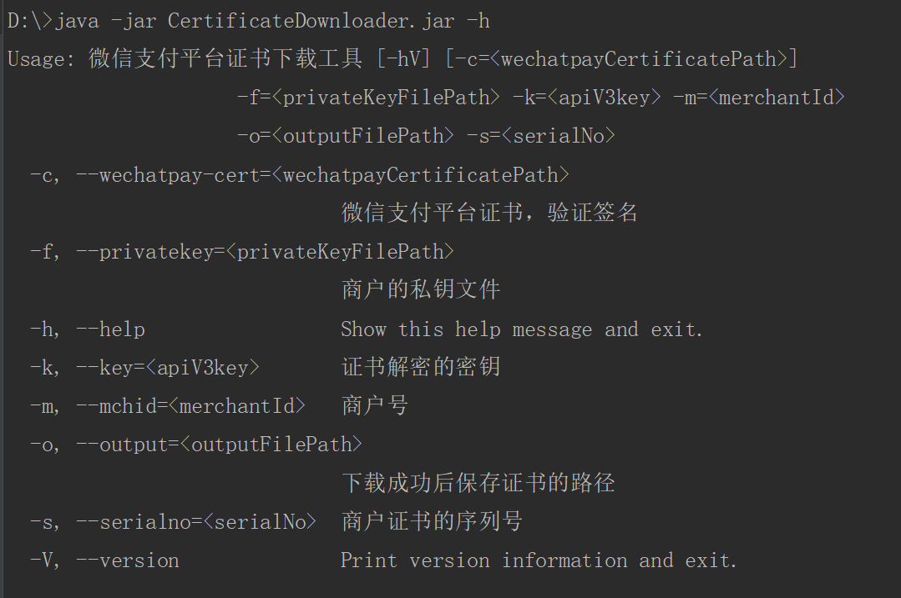

# Certificate Downloader

Certificate Downloader 是 Java 微信支付 APIv3 平台证书的命令行下载工具。该工具可从 `https://api.mch.weixin.qq.com/v3/certificates` 接口获取商户可用证书，并使用 [APIv3 密钥](https://wechatpay-api.gitbook.io/wechatpay-api-v3/ren-zheng/api-v3-mi-yao) 和 AES_256_GCM 算法进行解密，并把解密后证书下载到指定位置。

该工具使用了 [wechatpay-apache-httpclient]()、[Maven](https://github.com/apache/maven)、[picocli](https://github.com/remkop/picocli)、[gson]()、[lombok](https://github.com/rzwitserloot/lombok) 等库。

## 使用

该工具已经通过 Maven 打包成 CertificateDownloader.jar，可在 [release ](https://github.com/EliasZzz/CertificateDownloader/releases) 中下载。

执行  `java -jar CertificateDownloader.jar -h `，查看帮助：



这里，必需参数有：

- `-f <privateKeyFilePath>`，商户API私钥文件路径
- `-k <apiV3Key>`，证书解密的密钥
- `-m <merchantId>`，商户号
- `-o <outputFilePath>`，保存证书的路径
- `-s <merchantSerialNo>`，商户API证书的序列号

非必需参数有：

- `-c <wechatpayCertificatePath>`，微信支付平台证书的路径。如果你还没有证书，请先不传该参数。具体请看[常见问题-第一次下载证书](#第一次下载证书)。

完整命令如：

```
java -jar CertificateDownloader.jar -k ${apiV3key} -m ${mchId} -f ${mchPrivateKeyFilePath} -s ${mchSerialNo} -o ${outputFilePath} -c ${wechatpayCertificateFilePath}
```

## 如何保证证书正确

工具已经从以下方面去保证了：

- **HTTPS**：证书下载请求使用了 HTTPS
- **AES 加密**：微信支付对证书信息进行了 AES-256-GCM 加密，所以工具得到应答后，会使用**对称密钥**来解密证书（这里需要用户传入对称密钥，出于对**对称密钥**安全的考虑，后续版本将可直接保存未解密的证书，由用户进行解密）
- **报文验签**：微信支付会在应答的 HTTP 头包含签名，工具会通过解密得到的证书，来验证报文的签名，以此确认证书正确

下载证书后，如果仍然担心证书出错，可：

- **核对颁发者**：使用证书查看工具，核对证书的颁发者为 **Tenpay.com Root CA**
- **信任链验证**：通过证书信任链验证平台证书

### 使用信任链验证平台证书

使用 openssl 工具，通过证书信任链验证平台证书：
- 首先，从微信支付商户平台下载平台证书信任链 [CertTrustChain.p7b](https://wx.gtimg.com/mch/files/CertTrustChain.p7b)，并将它转换为 pem 证书格式：
  
  ```bash
  openssl pkcs7 -print_certs -in CertTrustChain.p7b -inform der -out CertTrustChain.pem
  ```
  
- 然后，-CAfile file 指定受信任的证书，验证下载的平台证书：

  ```bash
  openssl verify -verbose -CAfile ./CertTrustChain.pem ./WeChatPayPlatform.pem
  ```
  

## 常见问题

### 第一次下载证书

对于微信支付的应答，需要使用平台证书来进行验签；但平台证书只能通过 [获取平台证书接口](https://wechatpay-api.gitbook.io/wechatpay-api-v3/jie-kou-wen-dang/ping-tai-zheng-shu#huo-qu-ping-tai-zheng-shu-lie-biao) 下载，所以当第一次去获取证书时，会出现个“死循环”。

为解决这个“死循环”，可以临时跳过验签，来获得证书。也就是说可以不提供微信支付证书参数（-c 参数）来下载，在下载得到证书后，工具会使用下载得到的证书对报文的签名进行验证。

第一次下载证书后，我们**强烈建议**参考[指引](#如何保证证书正确)，验证证书的真实性。 

## 参考

- [微信支付 wechatpay-apache-httpclient 文档](https://github.com/wechatpay-apiv3/wechatpay-apache-httpclient/blob/master/README.md)
- [微信支付 APIv3 文档](https://pay.weixin.qq.com/wiki/doc/apiv3/wechatpay/wechatpay-1.shtml)
- [Picocli 文档](https://github.com/remkop/picocli/blob/master/README.md)
- [Gson 文档](https://github.com/google/gson/blob/master/README.md)
